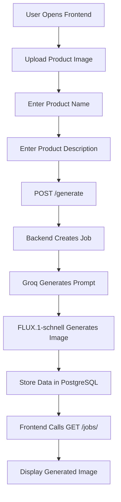

# VisionCraft AI

   

VisionCraft AI is an AI-powered product content generation web application that allows users to enter a product name, describe a product, upload an image, and receive a generated marketing prompt plus a realistic product image. The application uses Groq for prompt generation and Hugging Face FLUX.1-schnell for image generation, with all job data stored in PostgreSQL.

## Project Overview

VisionCraft AI brings together a responsive frontend, a Flask backend, and AI services into a single workflow for creating product-ready marketing assets. The application accepts user input, creates a backend job record, generates a prompt, creates an image, and stores the resulting assets for later retrieval.

## Key Features

- Upload a product image for reference.
- Enter a product name and description.
- Submit the form to create a background job.
- Generate an AI marketing prompt using Groq.
- Generate a realistic product image using Hugging Face FLUX.1-schnell.
- Store jobs, prompts, and generated image paths in PostgreSQL.
- Retrieve completed jobs through the API and display the generated image in the frontend.

## Screenshots

The project documentation includes the following screenshots in the docs folder:

- 
- 
- 
- 
- 
- 
- 
- 
- 
- 

## Architecture

VisionCraft AI follows a three-layer architecture composed of the frontend, backend, and PostgreSQL database. The backend orchestrates the generation workflow and integrates with Groq and Hugging Face services.



## Technology Stack

### Frontend
- HTML5
- CSS3
- JavaScript

### Backend
- Python
- Flask
- Flask-CORS
- SQLAlchemy

### Database
- PostgreSQL

### AI Services
- Groq API
- Hugging Face Inference API
- Model: black-forest-labs/FLUX.1-schnell

### Deployment
- Render

## Project Structure

```text
VisionCraft-AI/
├── backend/
├── frontend/
├── docs/
└── README.md
```

### Backend Structure
- app.py
- config.py
- requirements.txt
- database/
- models/
- routes/
- services/
- utils/
- static/
- tests/

### Frontend Structure
- index.html
- css/
- js/
- assets/

## Installation

1. Install Python on the development machine.
2. Create a virtual environment inside the backend folder.
3. Install the backend dependencies from requirements.txt.
4. Create a PostgreSQL database.
5. Configure the required environment variables.
6. Start the backend and serve the frontend.

## Environment Variables

The backend requires the following environment variables:

- SECRET_KEY
- DATABASE_URL
- GROQ_API_KEY
- HF_TOKEN

## Running the Backend

From the backend directory, create and activate a virtual environment, install dependencies, and start the application:

```bash
cd backend
python -m venv venv
venv\Scripts\activate
pip install -r requirements.txt
python app.py
```

## Running the Frontend

Serve the frontend directory with a simple static server:

```bash
cd frontend
python -m http.server 8000
```

The frontend can then be accessed in a browser at http://localhost:8000.

## API Endpoints

The main API endpoints are:

- GET /health
- POST /generate
- GET /jobs/<id>

For detailed request and response examples, see the API documentation in the docs folder.

## Deployment

The application is deployed on Render with:

- Backend URL: https://visioncraft-ai-backend-5g6f.onrender.com
- Frontend URL: https://visioncraft-ai-frontend.onrender.com

The backend uses a Render web service, the frontend uses a Render static site, and the database uses Render PostgreSQL.

## Workflow

1. The user opens the frontend.
2. The user uploads a product image and enters the product name and description.
3. The frontend sends a request to POST /generate.
4. The backend creates a job and sets its initial status to Processing.
5. Groq generates an image prompt and the prompt is stored in PostgreSQL.
6. The Hugging Face FLUX.1-schnell model generates the image and saves it in static/generated.
7. The generated image path is stored in PostgreSQL and the job status becomes Completed.
8. The frontend retrieves the job with GET /jobs/<id> and displays the generated image.

## Future Improvements

Potential extensions for the project include stronger job monitoring, expanded image generation options, and additional operational safeguards for production use.

## License

A formal license has not been specified in the provided project documentation. The repository should include a clear license before public distribution.

## Acknowledgements

This project uses the Flask ecosystem, SQLAlchemy, PostgreSQL, Groq, Hugging Face, and Render to deliver an end-to-end AI content generation experience.
